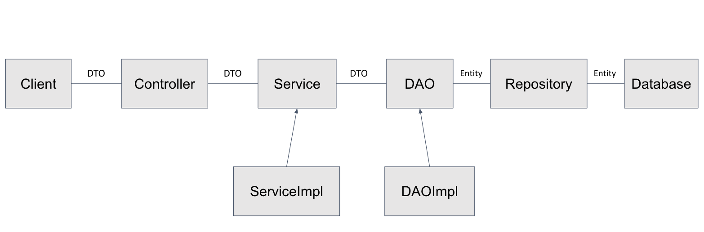

# SpringBoot CRUD Template
- 프로젝트 구조
  - `com.springboot.api`  
    ㄴ [폴더] `config`  
    ㄴ [폴더] `controller`  
    ㄴ [폴더] `dao`  
    ㄴ [폴더] `dto`  
    ㄴ [폴더] `entity`  
    ㄴ [폴더] `repository`  
    ㄴ [폴더] `service`  
- 애플리케이션 구조
  
- 특징
  - 데이터 베이스 접근로직을 관리하는 DAO패턴을 적용 
- Swagger url
  - http://localhost:8080/swagger-ui/index.html
